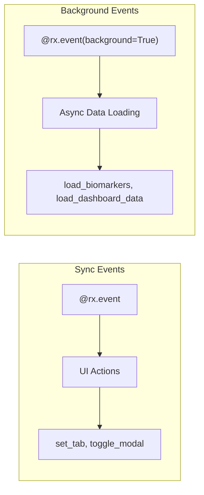
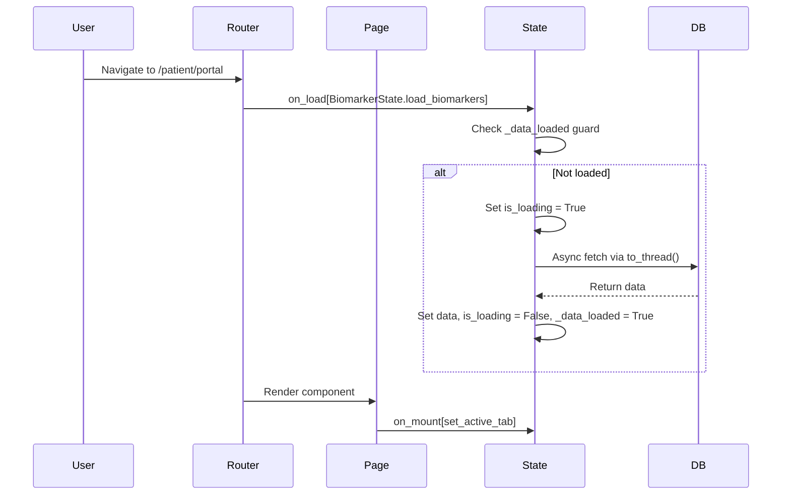

# State Management Documentation

> Reflex state patterns for the Longevity Clinic app

## Documentation Index

| Document | Description |
|----------|-------------|
| [README.md](./README.md) (this file) | State architecture, loading patterns, best practices |
| [processes/CHECKIN.md](./processes/CHECKIN.md) | Check-in data flow: patient input, call log CDC, dashboard sync |
| [SYSTEM.md](./SYSTEM.md) | System architecture, future work: webhooks, task queues |

## Quick Reference

### Route → on_load Mapping

| Route | on_load Handlers | States Initialized |
|-------|-----------------|-------------------|
| `/` | - | - |
| `/login` | - | - |
| `/admin/dashboard` | - | `AdminMetricsState` (via on_mount) |
| `/admin/checkins` | `CheckinState.load_admin_checkins` | `CheckinState` |
| `/admin/treatments` | `TreatmentState.load_protocols` | `TreatmentState` |
| `/patient/portal` | `BiomarkerState.load_biomarkers`, `HealthDashboardState.load_dashboard_data` | `BiomarkerState`, `HealthDashboardState` |
| `/patient/checkins` | `BiomarkerState.load_biomarkers`, `HealthDashboardState.load_dashboard_data`, `CheckinState.refresh_call_logs` | `BiomarkerState`, `HealthDashboardState`, `CheckinState` |
| `/patient/treatment-search` | `TreatmentSearchState.load_treatments` | `TreatmentSearchState` |
| `/patient/analytics` | - | - |
| `/patient/settings` | - | - |

### on_mount vs on_load

| Hook | Scope | Timing | Use Case |
|------|-------|--------|----------|
| `on_load` | Page | Before render, on route navigation | Data fetching, auth checks |
| `on_mount` | Component | After DOM mount | UI initialization, tab defaults |

## State Architecture

```mermaid
graph TD
    subgraph "Auth Flow"
        A[AuthState] -->|login| B{Role?}
        B -->|admin| C[/admin/dashboard]
        B -->|patient| D[/patient/portal]
    end

    subgraph "Admin States"
        C -->|on_mount| E[AdminMetricsState.load_metrics]
        F[/admin/checkins] -->|on_load| G[CheckinState.load_admin_checkins]
        H[/admin/treatments] -->|on_load| I[TreatmentState.load_protocols]
    end

    subgraph "Patient States"
        D -->|on_load| J[BiomarkerState.load_biomarkers]
        D -->|on_load| K[HealthDashboardState.load_dashboard_data]
        D -->|on_mount| L[HealthDashboardState.set_active_tab]
        M[/patient/checkins] -->|on_load| N[CheckinState.refresh_call_logs]
    end
```

## State Classes

### Core States

| State | Location | Purpose | Loading Guard |
|-------|----------|---------|---------------|
| `AuthState` | `states/auth/base.py` | Authentication, user session | `is_loading` |
| `BiomarkerState` | `states/patient/biomarker.py` | Biomarker analytics | `is_loading`, `_data_loaded` |
| `HealthDashboardState` | `states/shared/dashboard.py` | Health tracking (food, meds, symptoms) | `is_loading`, `_data_loaded` |
| `CheckinState` | `states/shared/checkin.py` | Check-ins for both roles | `is_loading`, `_admin_data_loaded` |
| `TreatmentState` | `states/treatments/treatment_state.py` | Treatment protocols (admin) | `_loaded` |
| `TreatmentSearchState` | `states/shared/treatment.py` | Treatment search (patient) | `_loaded` |
| `PatientState` | `states/patient/state.py` | Patient CRUD, selection, recently active | `is_loading`, `_data_loaded`, `_recent_loaded` |
| `AdminDashboardState` | `states/shared/dashboard.py` | Admin tab navigation only | (none) |
| `AdminMetricsState` | `states/admin_metrics_state.py` | Clinic metrics/charts | `is_loading`, `_data_loaded` |

## Loading Guard Pattern

All background event handlers use a guard pattern to prevent duplicate loads:

```python
@rx.event(background=True)
async def load_data(self):
    async with self:
        if self._data_loaded:  # Guard: skip if already loaded
            return
        self.is_loading = True  # Set loading state

    # Get user ID from AuthState (ALWAYS use this pattern)
    auth_state = await self.get_state(AuthState)
    user_id = auth_state.user_id
    if not user_id:
        logger.warning("No authenticated user")
        async with self:
            self.is_loading = False
        return

    try:
        data = await asyncio.to_thread(_fetch_sync, user_id)  # DB query
        async with self:
            self.data = data
            self.is_loading = False
            self._data_loaded = True
    except Exception as e:
        async with self:
            self.is_loading = False
```

### User ID Pattern

**Always** use `AuthState.user_id` for the authenticated user's database ID:

```python
# ✅ Correct: Get user ID from AuthState
auth_state = await self.get_state(AuthState)
user_id = auth_state.user_id

# ❌ Wrong: Hardcoded demo user lookups (DEPRECATED)
# user_id = get_primary_demo_user_id()  # Don't use this!
```

### Guard Variables

| State | Guard Variable | Reset On |
|-------|---------------|----------|
| `BiomarkerState` | `_data_loaded` | - |
| `HealthDashboardState` | `_data_loaded` | `clear_patient_health_data()` |
| `CheckinState` | `_admin_data_loaded` | - |
| `AdminMetricsState` | `_data_loaded` | `refresh_metrics()` |
| `TreatmentState` | `_loaded` | - |

## Event Handler Types



| Decorator | Use Case | Example |
|-----------|----------|---------|
| `@rx.event` | Sync UI updates | `set_active_tab`, `toggle_modal` |
| `@rx.event(background=True)` | Async DB queries, API calls | `load_biomarkers`, `load_metrics` |

## UI Loading States

### Components

| Component | Location | Usage |
|-----------|----------|-------|
| `loading_spinner(message)` | `components/shared/ui_components.py` | Data loading overlay |
| `empty_state(icon, message)` | `components/shared/ui_components.py` | No data placeholder |

### Example Usage

```python
rx.cond(
    MyState.is_loading,
    loading_spinner("Loading data..."),
    # Actual content
    data_content(),
)
```

## State Initialization Flow



## Best Practices

1. **Use on_load for data fetching** - Runs before render, ensures data ready
2. **Use on_mount for UI setup** - Tab defaults, scroll position, focus
3. **Always use loading guards** - Prevent duplicate API calls
4. **Show loading indicators** - Use `rx.cond(State.is_loading, spinner, content)`
5. **Background events for DB** - Never block UI with sync database calls

---

## Related Documentation

- [Check-in Data Flow](./processes/CHECKIN.md) - Patient input, call log CDC, dashboard sync
- [System Architecture](./SYSTEM.md) - Future work: webhooks, task queues, optimizations
- [VlogsAgent Setup](../vlogs_agent_setup.md) - LLM configuration for health extraction
- [Call Logs API](../call_logs_api.md) - External telephony API reference
