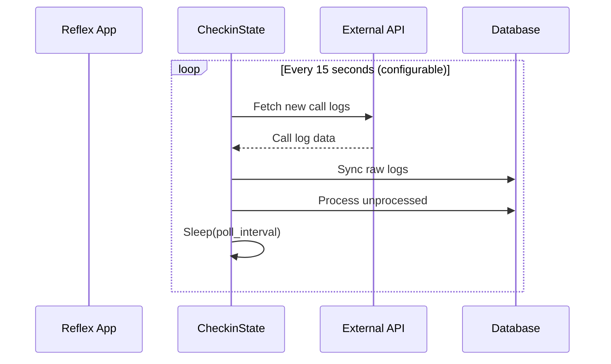
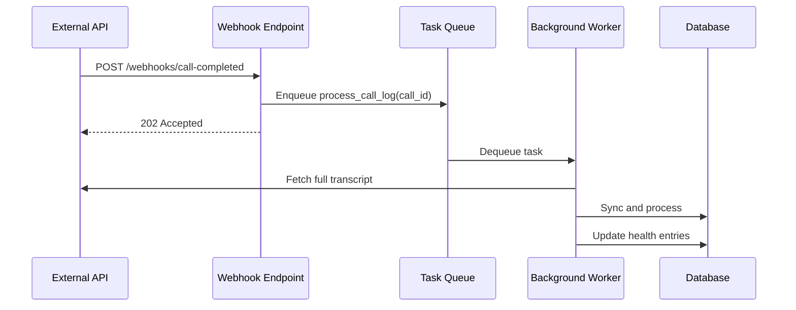
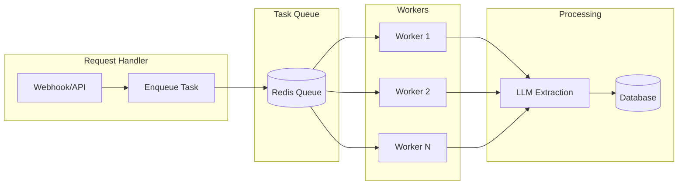
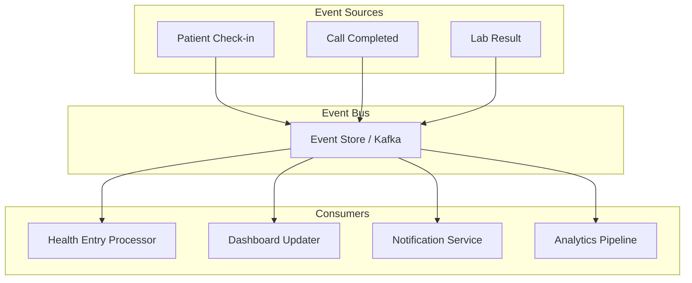

# System Architecture & Future Work

> Architectural decisions and optimization opportunities

## Current Architecture

### CDC Pipeline: Periodic Polling

The current call log sync uses a **periodic polling** pattern:



**Advantages:**
- Simple implementation
- No external dependencies
- Works behind firewalls/NAT
- Easy to debug and monitor

**Disadvantages:**
- Latency (up to `poll_interval` seconds delay)
- Wasted cycles polling when no new data
- Resource usage scales with number of active users

### Background Processing Model

Reflex's background events run in the same process:

```python
@rx.event(background=True)
async def start_calls_to_checkin_sync_loop(self):
    while self.is_processing_background:
        await process_batch()
        await asyncio.sleep(poll_interval)
```

**Current limitations:**
- Single process per Reflex instance
- No task distribution across workers
- Background tasks tied to user session lifecycle

---

## Future Work

### 1. Webhooks for Real-time CDC

Replace polling with webhooks for near-instant data sync:



#### Webhook Endpoint Design

```python
# Future: app/api/webhooks.py
from fastapi import FastAPI, BackgroundTasks

webhook_app = FastAPI()

@webhook_app.post("/webhooks/call-completed")
async def handle_call_completed(
    payload: CallCompletedPayload,
    background_tasks: BackgroundTasks
):
    """Webhook handler for new call completions."""
    # Validate webhook signature
    if not verify_signature(payload):
        raise HTTPException(401)
    
    # Enqueue for async processing
    background_tasks.add_task(
        process_single_call_log,
        call_id=payload.call_id
    )
    
    return {"status": "accepted"}
```

#### Benefits of Webhooks

| Metric | Polling (Current) | Webhooks (Future) |
|--------|-------------------|-------------------|
| Latency | 0-15 seconds | < 1 second |
| API calls/hour | 240 per user | 1 per event |
| Resource usage | Constant | Event-driven |
| Scalability | Limited | Horizontal |

#### Implementation Considerations

1. **Webhook reliability** - External API must support webhooks
2. **Retry logic** - Handle failed webhook deliveries
3. **Idempotency** - Same event may be delivered multiple times
4. **Security** - Validate webhook signatures

---

### 2. Task Queue Integration

Decouple long-running LLM processing from the request cycle:



#### Reflex + Redis

Reflex ships with Redis support for state management:

```python
# rxconfig.py - Reflex already uses Redis
config = rx.Config(
    app_name="longevity_clinic",
    state_manager_mode="redis",  # Already available
)
```

#### Task Queue Options

| Option | Pros | Cons |
|--------|------|------|
| **Celery + Redis** | Battle-tested, monitoring UI | Complex setup |
| **RQ (Redis Queue)** | Simple, Python-native | Limited features |
| **ARQ** | Async-native, lightweight | Less ecosystem |
| **Dramatiq** | Good defaults, retries | Medium complexity |

#### Example: ARQ Integration

```python
# Future: app/tasks/call_processing.py
from arq import create_pool
from arq.connections import RedisSettings

async def process_call_log(ctx, call_id: str):
    """ARQ task for processing a single call log."""
    agent = VlogsAgent.from_config()
    
    # Fetch transcript
    transcript = await fetch_transcript(call_id)
    
    # LLM extraction (potentially slow)
    output = await agent.extract_health_data(transcript)
    
    # Persist to database
    await update_call_log_metrics(call_id, output)
    
    return {"status": "processed", "call_id": call_id}

class WorkerSettings:
    redis_settings = RedisSettings()
    functions = [process_call_log]
    max_jobs = 10
```

#### Benefits of Task Queues

1. **Horizontal scaling** - Add workers as load increases
2. **Fault tolerance** - Failed tasks retry automatically
3. **Rate limiting** - Control LLM API usage
4. **Priority queues** - Urgent check-ins processed first
5. **Monitoring** - Visibility into queue depth, processing times

---

### 3. Event-Driven Architecture

Long-term evolution toward event sourcing:



#### Event Types

```python
# Future: app/events/schemas.py
class CheckInCreated(BaseEvent):
    checkin_id: str
    user_id: int
    content: str
    source: Literal["voice", "text", "call"]

class HealthEntryExtracted(BaseEvent):
    checkin_id: str
    medications: list[MedicationEntry]
    food_entries: list[FoodEntry]
    symptoms: list[Symptom]

class DashboardRefreshNeeded(BaseEvent):
    user_id: int
    reason: str
```

---

### 4. Optimizations

#### LLM Caching

Cache LLM responses for identical inputs:

```python
# Future: app/functions/vlogs/cache.py
from functools import lru_cache
import hashlib

def cache_key(content: str) -> str:
    return hashlib.sha256(content.encode()).hexdigest()

@lru_cache(maxsize=1000)
async def cached_extraction(content_hash: str, content: str):
    return await agent.extract_health_data(content)
```

#### Batch Processing

Process multiple call logs in single LLM call:

```python
# Future: Batch extraction
async def extract_batch(transcripts: list[str]) -> list[MetricLogsOutput]:
    """Extract from multiple transcripts in one LLM call."""
    combined_prompt = format_batch_prompt(transcripts)
    response = await llm.ainvoke(combined_prompt)
    return parse_batch_response(response)
```

#### Database Optimizations

```sql
-- Indexes for common queries
CREATE INDEX idx_checkins_user_timestamp 
    ON checkins(user_id, timestamp DESC);

CREATE INDEX idx_call_logs_unprocessed 
    ON call_logs(processed_to_metrics) 
    WHERE processed_to_metrics = FALSE;

CREATE INDEX idx_health_entries_user 
    ON medication_entries(user_id, created_at DESC);
```

---

## Migration Path

### Phase 1: Current State ✅
- Periodic polling (15s interval, configurable via `AppConfig.background_poll_interval`)
- In-process background tasks
- SQLite/PostgreSQL storage

### Phase 2: Task Queue
- Add ARQ/Celery for LLM processing
- Keep polling for compatibility
- Add monitoring dashboard

### Phase 3: Webhooks
- Implement webhook endpoints
- Migrate from polling to push
- Keep polling as fallback

### Phase 4: Event-Driven
- Introduce event bus (Redis Streams / Kafka)
- Decouple services
- Enable real-time dashboards

---

## Configuration Evolution

```python
# Current (config.py)
class AppConfig:
    background_poll_interval: int = 15  # Configurable poll interval
    reprocess_call_logs_everytime: bool = False

# Future
class AppConfig:
    # CDC Mode
    cdc_mode: Literal["polling", "webhook", "hybrid"] = "polling"
    poll_interval: int = 15  # Default matches current
    
    # Task Queue
    task_queue_enabled: bool = False
    task_queue_backend: str = "redis://localhost:6379"
    max_workers: int = 4
    
    # Webhooks
    webhook_secret: str = ""
    webhook_retry_count: int = 3
    
    # LLM
    llm_cache_enabled: bool = True
    llm_batch_size: int = 5
```

---

## Related Documentation

- [Check-in Data Flow](./processes/CHECKIN.md) - Current implementation details
- [State Management Overview](./README.md) - Reflex state patterns
- [VlogsAgent Setup](../vlogs_agent_setup.md) - LLM configuration
