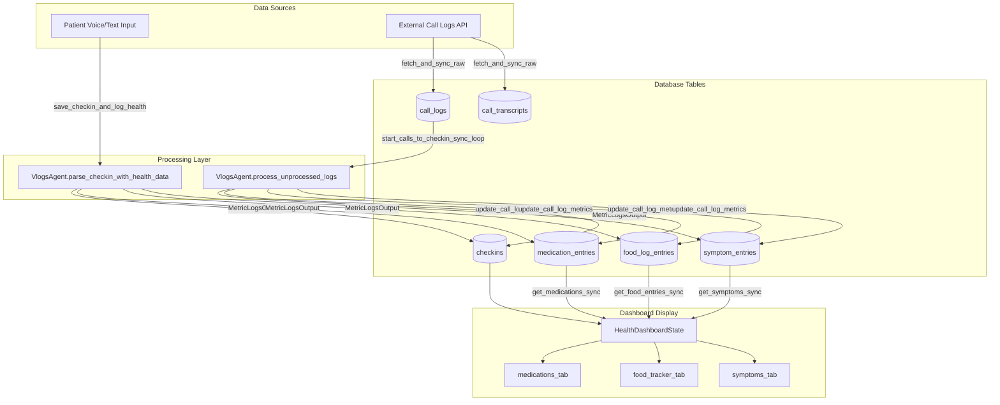
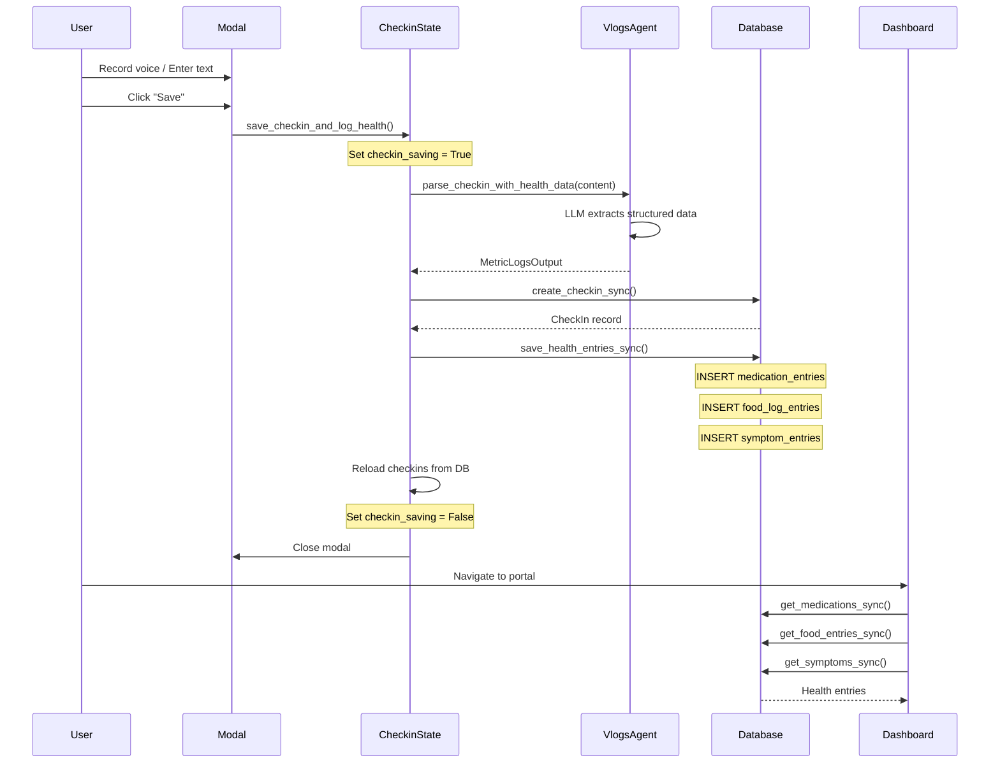
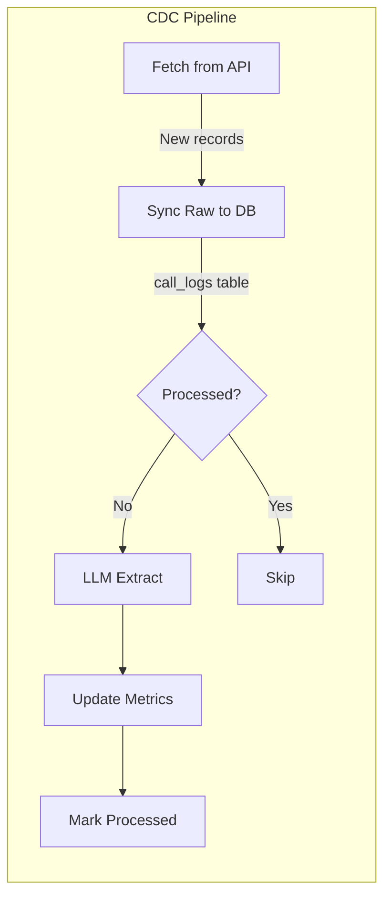
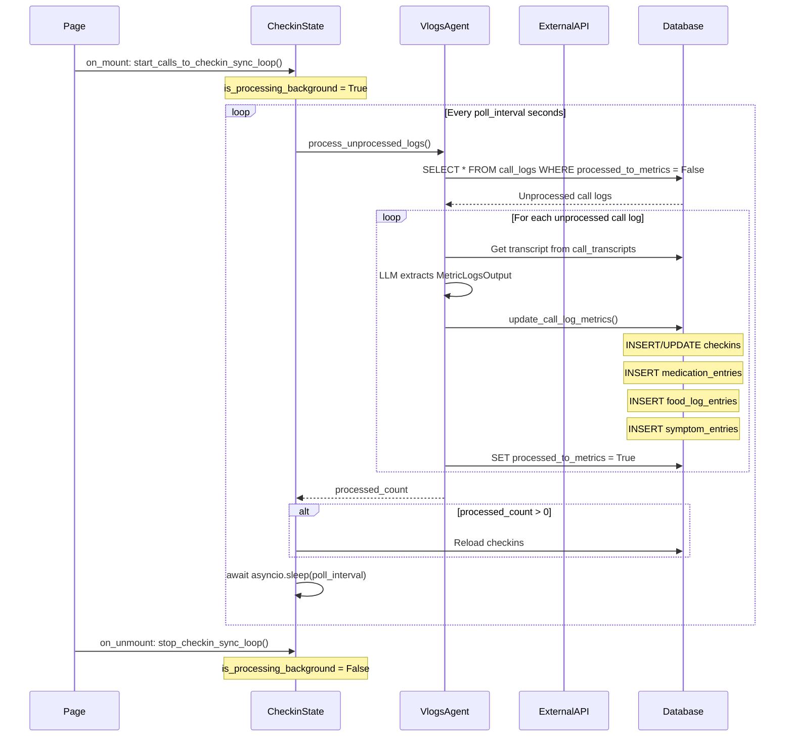

# Check-in Data Flow

> How patient check-ins flow from input to dashboard display

## Overview

The check-in system supports two data sources that populate health data (medications, food, symptoms) displayed on the patient dashboard:

1. **Patient Check-ins** (voice/text) - Direct user input via the check-in modal
2. **Call Log Sync** (CDC pipeline) - Automated sync from external telephony API

Both pathways use LLM extraction to parse unstructured content into structured health entries.

## Architecture



## Data Source 1: Patient Check-ins (Voice/Text)

### Trigger
- User opens check-in modal on `/patient/checkins`
- Records voice or enters text
- Clicks "Save Check-in"

### Event Handler

```python
# CheckinState.save_checkin_and_log_health()
@rx.event(background=True)
async def save_checkin_and_log_health(self):
    """Background event for non-blocking UI."""
```

### Flow



### Database Operations

| Step | Function | Table(s) |
|------|----------|----------|
| 1 | `create_checkin_sync()` | `checkins` |
| 2 | `save_health_entries_sync()` | `medication_entries`, `food_log_entries`, `symptom_entries` |

### MetricLogsOutput Schema

```python
class MetricLogsOutput(BaseModel):
    checkin: CheckInSummary           # Summary, sentiment, topics
    medications_entries: list[MedicationEntry]  # Name, dosage, frequency
    food_entries: list[FoodEntry]     # Name, calories, macros
    symptom_entries: list[Symptom]    # Name, severity, trend
```

---

## Data Source 2: Call Log Sync (CDC Pipeline)

### Trigger
- Page mount on `/patient/checkins` starts background loop
- Periodic polling every N seconds (configurable)
- Manual refresh via `refresh_call_logs()`

### Background Event Handler

```python
# CheckinState.start_calls_to_checkin_sync_loop()
@rx.event(background=True)
async def start_calls_to_checkin_sync_loop(self):
    """CDC pipeline for call log processing."""
```

### CDC (Change Data Capture) Pattern

The CDC pattern ensures:
1. **Idempotency** - Same call log is never processed twice
2. **Incremental sync** - Only new/unprocessed records are handled
3. **Failure recovery** - Partial failures don't corrupt data



### Flow



### Lifecycle Events

| Event | Method | Description |
|-------|--------|-------------|
| `on_mount` | `start_calls_to_checkin_sync_loop()` | Start background polling |
| `on_unmount` | `stop_checkin_sync_loop()` | Stop background polling |
| Manual | `refresh_call_logs()` | One-time sync from API |

### Database Operations

| Step | Function | Table(s) |
|------|----------|----------|
| 1 | `fetch_and_sync_raw()` | `call_logs`, `call_transcripts` |
| 2 | `get_unprocessed_call_logs_sync()` | `call_logs` (read) |
| 3 | `update_call_log_metrics()` | `checkins`, `medication_entries`, `food_log_entries`, `symptom_entries` |
| 4 | `mark_call_log_processed_sync()` | `call_logs.processed_to_metrics = True` |

### Configuration

```python
# config.py
class AppConfig:
    background_poll_interval: int = 15  # Seconds between polls
    reprocess_call_logs_everytime: bool = False  # Debug flag
```

---

## Dashboard Data Fetch

Both data sources ultimately populate the same database tables. The dashboard fetches from these tables:

### HealthDashboardState Loading

```python
@rx.event(background=True)
async def load_dashboard_data(self):
    # Get user ID from AuthState
    auth_state = await self.get_state(AuthState)
    user_id = auth_state.user_id
    
    # Fetch from normalized tables
    medications = await asyncio.to_thread(get_medications_sync, user_id)
    food_entries = await asyncio.to_thread(get_food_entries_sync, user_id)
    symptoms = await asyncio.to_thread(get_symptoms_sync, user_id)
```

### Data Flow Summary

```
┌─────────────────────────────────────────────────────────────────┐
│                     DATA SOURCES                                │
├─────────────────────────────────────────────────────────────────┤
│  Patient Input              │  External Call Logs API          │
│  (voice/text)               │  (telephony system)              │
└──────────────┬──────────────┴──────────────┬────────────────────┘
               │                              │
               ▼                              ▼
┌──────────────────────────────────────────────────────────────────┐
│                    LLM EXTRACTION (VlogsAgent)                   │
│  - parse_checkin_with_health_data() for manual input             │
│  - process_unprocessed_logs() for call transcripts               │
│  - Output: MetricLogsOutput (checkin + health entries)           │
└──────────────────────────────┬───────────────────────────────────┘
                               │
                               ▼
┌──────────────────────────────────────────────────────────────────┐
│                    DATABASE TABLES                               │
│  ┌──────────────┐  ┌───────────────────┐  ┌──────────────────┐  │
│  │   checkins   │  │ medication_entries│  │ food_log_entries │  │
│  └──────────────┘  └───────────────────┘  └──────────────────┘  │
│  ┌──────────────────┐  ┌──────────────┐  ┌──────────────────┐   │
│  │ symptom_entries  │  │  call_logs   │  │ call_transcripts │   │
│  └──────────────────┘  └──────────────┘  └──────────────────┘   │
└──────────────────────────────┬───────────────────────────────────┘
                               │
                               ▼
┌──────────────────────────────────────────────────────────────────┐
│                 DASHBOARD (HealthDashboardState)                 │
│  - get_medications_sync() → self.medications                     │
│  - get_food_entries_sync() → self.food_entries                   │
│  - get_symptoms_sync() → self.symptoms                           │
└──────────────────────────────────────────────────────────────────┘
```

---

## State Variables

### CheckinState

| Variable | Type | Purpose |
|----------|------|---------|
| `checkins` | `list[CheckInWithTranscript]` | All check-ins for display |
| `checkin_saving` | `bool` | Shows saving indicator |
| `call_logs_syncing` | `bool` | Shows sync indicator |
| `is_processing_background` | `bool` | Background loop active |
| `last_sync_time` | `str` | Timestamp of last sync |

### HealthDashboardState

| Variable | Type | Source Table |
|----------|------|--------------|
| `medications` | `list[MedicationEntry]` | `medication_entries` |
| `food_entries` | `list[FoodEntry]` | `food_log_entries` |
| `symptoms` | `list[Symptom]` | `symptom_entries` |

---

## Error Handling

### Patient Check-in Errors

```python
try:
    parse_result = await VlogsAgent.parse_checkin_with_health_data(...)
except Exception as e:
    logger.error("save_checkin_and_log_health failed: %s", e)
finally:
    async with self:
        self.checkin_saving = False
        self.show_checkin_modal = False
```

### CDC Pipeline Errors

```python
try:
    processed_count = await agent.process_unprocessed_logs()
except Exception as e:
    logger.error("Background processing error: %s", e)
# Loop continues - doesn't crash on single failure
```

---

## Related Documentation

- [State Management Overview](../README.md) - Loading guards, event patterns
- [VlogsAgent Setup](../../vlogs_agent_setup.md) - LLM configuration
- [System Architecture](../SYSTEM.md) - Future work: webhooks, task queues
