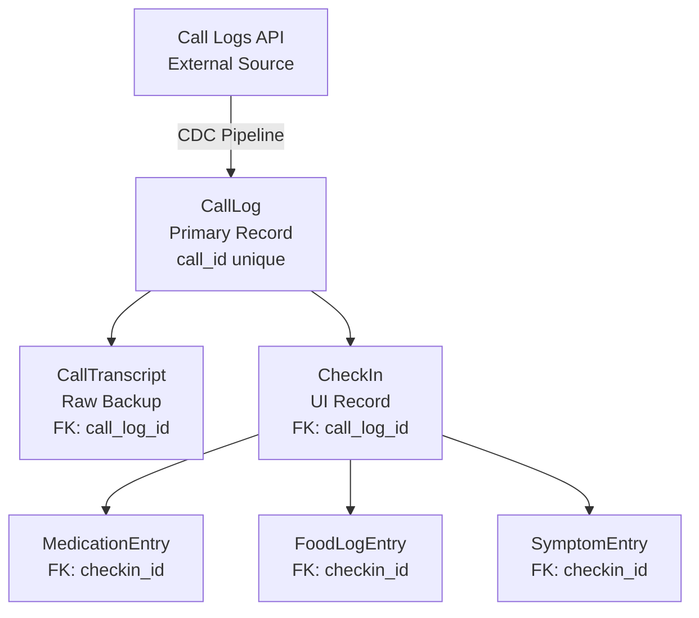

# VlogsAgent - Call Logs CDC Pipeline

## Overview

VlogsAgent implements a **Change Data Capture (CDC)** pattern for processing voice call logs into structured health data. The pipeline fetches call logs from an external API, processes them with LLM extraction, and syncs results to the database.

## Architecture

```mermaid
flowchart TD
    subgraph External
        API[Call Logs API]
    end

    subgraph CDC Pipeline
        FETCH[1. Fetch Call Logs]
        DIFF[2. Diff Against DB]
        LLM[3. LLM Extraction]
        SYNC[4. Sync to DB]
    end

    subgraph Database
        CL[CallLog]
        CT[CallTranscript]
        CHK[CheckIn]
        MED[MedicationEntry]
        FOOD[FoodLogEntry]
        SYM[SymptomEntry]
    end

    subgraph State
        DS[Dashboard States (FoodState, MedicationState, etc.)]
        CKS[CheckinState]
    end

    API --> FETCH
    FETCH --> DIFF
    DIFF -->|New logs| LLM
    LLM -->|MetricLogsOutput| SYNC
    SYNC --> CL & CT & CHK
    CHK -->|checkin_id FK| MED & FOOD & SYM
    MED & FOOD & SYM --> DS
    CHK --> CKS
```

## Data Flow

### 1. Source of Truth Hierarchy



### 2. Schema Mapping: Pydantic ↔ Database

**MetricLogsOutput** (Pydantic) maps to database tables:

| Pydantic Field        | DB Table          | Strategy                    |
|-----------------------|-------------------|-----------------------------||
| `checkin`             | `CheckIn`         | Direct field copy           |
| `medications_entries[]`| `MedicationEntry` | Normalized via checkin_id   |
| `food_entries[]`      | `FoodLogEntry`    | Normalized via checkin_id   |
| `symptom_entries[]`   | `SymptomEntry`    | Normalized via checkin_id   |

**Storage:**
- Health entries link via `checkin_id` FK
- Raw transcript: `CheckIn.call_log_id → CallTranscript.raw_transcript`
- `CheckIn.raw_content` only for manual/voice check-ins

### 3. Idempotency & Efficiency

```python
# CDC Sync: fetch → diff → process new only → sync
async def sync_call_logs():
    existing_ids = {row.call_id for row in CallLog.select()}
    api_logs = await fetch_call_logs()
    new_logs = [log for log in api_logs if log["call_id"] not in existing_ids]
    
    for log in new_logs:
        output = await agent.process_single(log)  # LLM only for new
        await sync_to_database(log, output)
```

## Database Tables

- `CallLog` - Primary call record
- `CallTranscript` - Raw transcript storage
- `CheckIn` - Canonical check-in record
- `MedicationEntry`, `FoodLogEntry`, `SymptomEntry` - Health data (FK: checkin_id)

## Key Components

**VlogsConfig:**
```python
extract_with_llm: bool = True      # Enable LLM extraction
llm_model: str = "gpt-4o-mini"     # Model
temperature: float = 0.3           # Low for consistency
limit: int = 50                    # API fetch limit
output_schema: Type[BaseModel]     # MetricLogsOutput
```

**VlogsAgent Methods:**
- `fetch()` - Fetch logs from API
- `process_single()` - Parse one log with LLM
- `process_logs()` - Batch process with dedup
- `sync_to_db()` - Persist to database

## State Integration

**CheckinState.refresh_call_logs():**
```python
@rx.event(background=True)
async def refresh_call_logs(self):
    # Get processed IDs, fetch new, sync to DB
    agent = VlogsAgent.from_config()
    new_count, outputs = await agent.process_and_sync(phone_number=demo_phone)
    async with self:
        self.checkins = await load_checkins_from_db()
```

**Dashboard States (FoodState, MedicationState, etc.).load_dashboard_data():**
```python
@rx.event(background=True)
async def load_dashboard_data(self):
    with rx.session() as session:
        meds = session.exec(select(MedicationEntry).where(...))
        foods = session.exec(select(FoodLogEntry).where(...))
    async with self:
        self.medications = list(meds)
        self.food_entries = list(foods)
```

## Sync vs Async Database

Reflex/SQLite uses sync sessions. Background tasks wrap with `asyncio.to_thread()`:

```python
# VlogsAgent sync method
def get_processed_call_ids_sync(self) -> set[str]:
    with rx.session() as session:
        return set(session.exec(select(CallLog.call_id)).all())

# Called from async context
processed_ids = await asyncio.to_thread(self.get_processed_call_ids_sync)
```

## Usage

**Trigger CDC Sync:**
```python
await CheckinState.refresh_call_logs()  # Patient check-ins page
```

**Load Dashboard Data:**
```python
await Dashboard States (FoodState, MedicationState, etc.).load_health_data_from_db()
```

**Direct Agent:**
```python
from longevity_clinic.app.states.functions import VlogsAgent

agent = VlogsAgent.from_config()
new_count, outputs = await agent.process_and_sync(phone_number="+1234567890")
```
