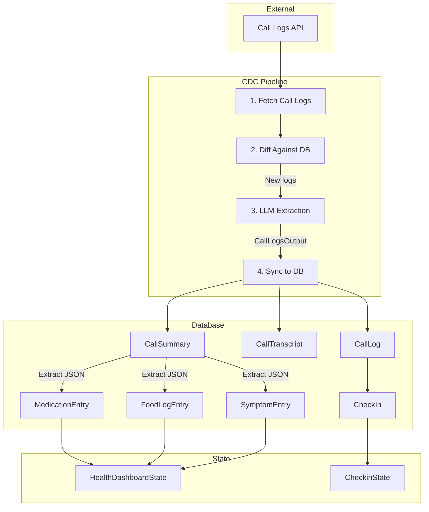

# VlogsAgent - Call Logs CDC Pipeline

## Overview

VlogsAgent implements a **Change Data Capture (CDC)** pattern for processing voice call logs into structured health data. The pipeline fetches call logs from an external API, processes them with LLM extraction, and syncs results to the database.

## Architecture



## Data Flow

### 1. Source of Truth Hierarchy

```
┌─────────────────────────────────────────────────────────────────┐
│                    CALL LOGS API (External)                      │
│                    Source: call_id, transcript                   │
└─────────────────────────────┬───────────────────────────────────┘
                              │
                              ▼
┌─────────────────────────────────────────────────────────────────┐
│                    CallLog (DB Table)                            │
│                    Primary record of call existence              │
│                    FK: call_id (unique, indexed)                 │
└─────────────────────────────┬───────────────────────────────────┘
                              │
              ┌───────────────┼───────────────┐
              │               │               │
              ▼               ▼               ▼
┌─────────────────┐ ┌─────────────────┐ ┌─────────────────┐
│ CallTranscript  │ │  CallSummary    │ │    CheckIn      │
│ Raw text backup │ │ LLM extraction  │ │ UI-facing record│
│ FK: call_log_id │ │ FK: call_log_id │ │ FK: call_log_id │
└─────────────────┘ └────────┬────────┘ └─────────────────┘
                             │
         ┌───────────────────┼───────────────────┐
         │                   │                   │
         ▼                   ▼                   ▼
┌─────────────────┐ ┌─────────────────┐ ┌─────────────────┐
│ MedicationEntry │ │  FoodLogEntry   │ │  SymptomEntry   │
│ FK: call_log_id │ │ FK: call_log_id │ │ FK: call_log_id │
│ FK: summary_id  │ │ FK: summary_id  │ │ FK: summary_id  │
└─────────────────┘ └─────────────────┘ └─────────────────┘
```

### 2. Schema Mapping: Pydantic ↔ Database

The **CallLogsOutput** (Pydantic) serves as the LLM output schema. Each field maps to database tables:

| Pydantic Field        | DB Table          | Mapping Strategy                    |
|-----------------------|-------------------|-------------------------------------|
| `checkin`             | `CheckIn`         | Direct field copy                   |
| `medications[]`       | `MedicationEntry` | JSON in CallSummary + normalized    |
| `food_entries[]`      | `FoodLogEntry`    | JSON in CallSummary + normalized    |
| `has_medications`     | `CallSummary`     | Flag field                          |
| `has_nutrition`       | `CallSummary`     | Flag field                          |

**Dual Storage Strategy:**
1. **CallSummary.medications_json**: JSON blob for fast read (denormalized)
2. **MedicationEntry table**: Normalized for queries, aggregations, dashboards

### 3. Idempotency & Efficiency

```python
# CDC Sync Pattern
async def sync_call_logs():
    # 1. Get existing call_ids from DB
    existing_ids = {row.call_id for row in CallLog.select()}
    
    # 2. Fetch from API
    api_logs = await fetch_call_logs()
    
    # 3. Filter new logs only
    new_logs = [log for log in api_logs if log["call_id"] not in existing_ids]
    
    # 4. Process only new logs with LLM (expensive)
    for log in new_logs:
        output = await agent.process_single(log)
        # 5. Insert to DB in transaction
        await sync_to_database(log, output)
```

## Database Tables

### Core Tables (Existing)
- `CallLog` - Primary call record
- `CallTranscript` - Raw transcript storage
- `CallSummary` - AI-generated summary + JSON blobs
- `CheckIn` - Patient check-in record

### Health Data Tables (New)
- `MedicationEntry` - Extracted medication mentions
- `FoodLogEntry` - Extracted food/nutrition data
- `SymptomEntry` - Extracted symptom reports

## Key Components

### VlogsConfig
```python
class VlogsConfig(BaseModel):
    extract_with_llm: bool = True      # Enable LLM extraction
    llm_model: str = "gpt-4o-mini"   # Model to use
    temperature: float = 0.3         # Low for consistency
    limit: int = 50                  # API fetch limit
    output_schema: Type[BaseModel]   # CallLogsOutput
```

### VlogsAgent Methods

| Method | Description |
|--------|-------------|
| `fetch()` | Fetch logs from external API |
| `process_single()` | Parse one log with LLM |
| `process_logs()` | Batch process with dedup |
| `sync_to_db()` | Persist to database tables |

## State Integration

### CheckinState.refresh_call_logs()
```python
from .data.patients import _get_demo_phone_number
@rx.event(background=True)
async def refresh_call_logs(self):
    # 1. Get processed IDs from DB
    async with rx.asession() as session:
        existing = await session.exec(select(CallLog.call_id))
        processed_ids = set(existing.all())
    
    # 2. Fetch & process new logs
    agent = VlogsAgent.from_config()
    new_count, outputs, summaries = await agent.process_logs(
        phone_number=_get_demo_phone_number(),
        processed_ids=processed_ids
    )
    
    # 3. Sync to DB
    await agent.sync_to_db(outputs, summaries)
    
    # 4. Update UI state
    async with self:
        self.checkins = await load_checkins_from_db()
```

### HealthDashboardState.load_dashboard_data()
```python
@rx.event(background=True)
async def load_dashboard_data(self):
    async with rx.asession() as session:
        # Load from normalized tables
        meds = await session.exec(
            select(MedicationEntry).where(
                MedicationEntry.user_id == self.current_user_id
            )
        )
        foods = await session.exec(
            select(FoodLogEntry).where(
                FoodLogEntry.user_id == self.current_user_id
            )
        )
    
    async with self:
        self.medications = [med.to_pydantic() for med in meds]
        self.food_entries = [food.to_pydantic() for food in foods]
```

## Processing Status

- [x] VlogsAgent basic structure
- [x] LLM extraction with CallLogsOutput
- [x] CallLog, CallTranscript, CallSummary tables
- [x] MedicationEntry, FoodLogEntry, SymptomEntry tables
- [x] Database sync in VlogsAgent (`process_and_sync()`, `sync_single_to_db_sync()`)
- [x] CheckinState DB integration (`refresh_call_logs()` uses CDC pipeline)
- [x] HealthDashboardState DB queries (`load_health_data_from_db()`)
- [x] Migration and testing
- [x] **Fixed: Async DB issue** - Changed from `rx.asession()` to `rx.session()` with `asyncio.to_thread()`
- [x] **Fixed: Type mismatch** - `fetch_food_entries()` now returns `List[FoodEntry]` instead of `List[Dict]`

## Sync vs Async Database Operations

Reflex uses SQLite by default, which doesn't support async operations natively. The CDC pipeline uses sync sessions with `asyncio.to_thread()` for background tasks:

```python
# VlogsAgent sync methods
def get_processed_call_ids_sync(self) -> set[str]:
    with rx.session() as session:
        result = session.exec(select(CallLog.call_id))
        return set(result.all())

# Called from async context with asyncio.to_thread()
processed_ids = await asyncio.to_thread(self.get_processed_call_ids_sync)
```

## Usage

### Trigger CDC Sync (Patient View)
```python
# In patient check-ins page, triggers full CDC pipeline
await CheckinState.refresh_call_logs()
```

### Load Dashboard Data from DB
```python
# After CDC sync, reload dashboard with DB data
await HealthDashboardState.load_health_data_from_db()
```

### Direct Agent Usage
```python
from longevity_clinic.app.states.functions import VlogsAgent
from longevity_clinic.app.config import VlogsConfig
from longevity_clinic.app.data.process_schema import CallLogsOutput

# Create agent with config
config = VlogsConfig(extract_with_llm=True, output_schema=CallLogsOutput)
agent = VlogsAgent(config=config)

# Full CDC pipeline: fetch -> diff -> LLM process -> sync to DB
new_count, outputs = await agent.process_and_sync(phone_number="+1234567890")
```
